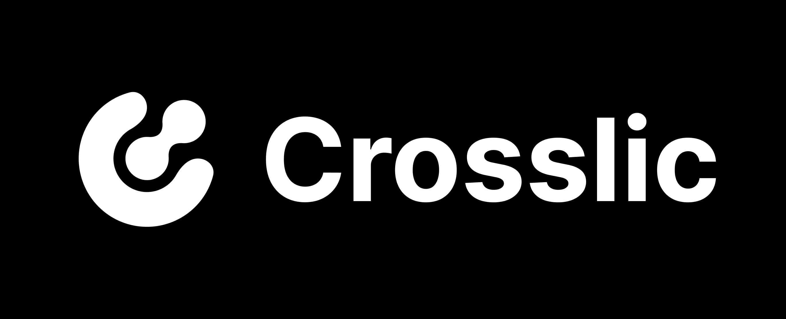

# Introduction

Crosslic is a very minimalistic framework for creating maximally cross-platform desktop and mobile applications. It has only what is minimally necessary, nothing extra.

Crosslic runs in two independent processes, which allows you to create a highly loaded backend with an instant response from the frontend.


# Getting Started

To get started with Crosslic, follow these simple steps:

1. Clone the repository:
   ```
   git clone https://github.com/Faynot/crosslic.git
   ```
2. Install dependencies:
   ```
   cd crosslic/frontend
   pnpm install
   ```
3. Run the project:
   ```
   cd ../
   chmod +x start.sh
   ./start.sh
   ```

   or run for wayland:
   ```
   ./start_wayland.sh
   ```

4. Build the project:
   ```
   cd ../
   chmod +x build.sh
   ./build.sh
   ```

# How to create and use command

go to project and open Crosslic_App/src/commands.rs:
```
use crosslic::command;

//===================
//      Commands
//===================

// Simple command examples

#[command]
pub fn sum(a: i32, b: i32) -> Result<i32, String> {
    Ok(a + b)
}

#[command]
pub fn greet(name: String) -> Result<String, String> {
    Ok(format!("Hello, {}!", name))
}

```

Create a team using a template:
```
#[command]
pub fn command(a: i32, b: i32) -> ... {
    // any logic
}
```

Run in frontend:
```

```


# Todo

- [ ] Create CLI
- [ ] npm, yarn support
- [ ] react native, vue, angular support (in CLI)
- [ ] Completely end development mode
